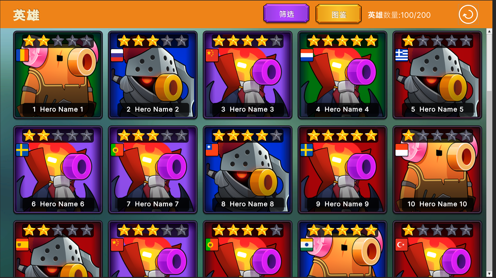

# Unity-UIToolkit-Demo

Unity版本: Unity2021.2.4f1

这是一个使用 Unity UI Toolkit 制作相对复杂UI的Demo工程，目的是学习UI Toolkit的编辑使用，Demo中也简单的使用了Addressables加载资源的。

**说明:**  
1.UI Toolkit的ScrollView/ListView组件不支持多行多列的方式进行排列（像UGUI的Grid）,Demo里使用嵌套的方式实现了Grid的方式展现。    
2.Unity2022.1版本里UI Toolkit新增了MultiColumnListView等组件，但目前还处于开发阶段且只能使用代码创建无法在UI Builder里使用。源代码:https://github.com/Unity-Technologies/UnityCsReference/tree/master/ModuleOverrides/com.unity.ui/Core/Controls/MultiColumn   
3.关于ScrollView滑动的问题，在Editor状态下只能滑动鼠标或拖动滑动条才可以上下左右滑动暂不支持点击元素实现滑动效果，但据说在设备上可以实现该效果，待验证！  
4.UI暂未使用Atlas的方式制作，而且也暂未考虑DrawCall的开销，后面将会重新考虑。  

ScrollView 效果预览:  
